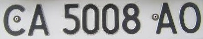
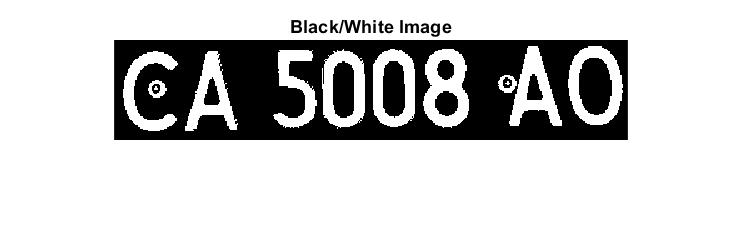
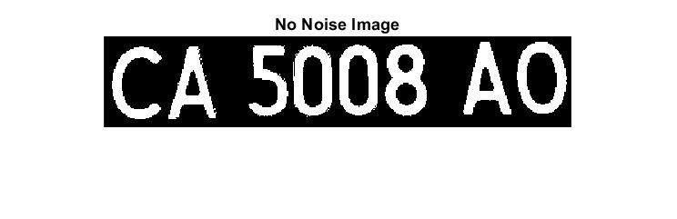
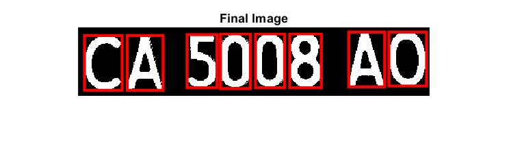

# AutomaticLicensePlateRecognition

A MatLab program where you can recognize characters from vehicle license and highlight the results.
This application was originally developed in **2017-2018** during a college course.

## What I learnt

* Optical Character Recognition (OCR)
* Folder/Directory Manipulation using MatLab

## Input vs Output

This is a sample of the final results ...  
* **Original** image:  
  
* **Black-and-White** image:  
  
* **filtered** image: *After removing small objects*  
  
* **Final** image:  

